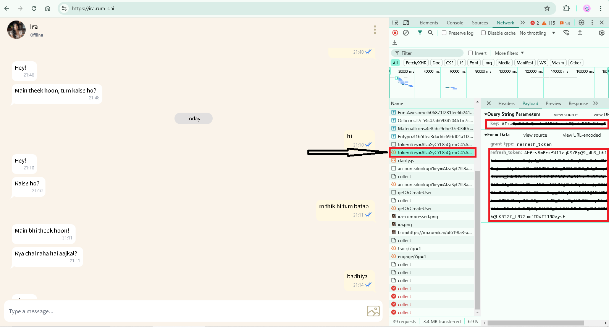

# IraAI Virtual Girlfriend
**IraAI** is a Python-based virtual AI girlfriend designed for fun, casual conversations, and engaging interactions. With this program, you can chat with an AI-powered virtual personality and receive dynamic responses to your messages.

## Features
- Chat with IraAI using natural language.
- Real-time streaming responses for a smooth conversation experience.
- AI reactions including "like," "love," and "haha."

## How It Works
IraAI interacts with an API to simulate a virtual girlfriend experience. You provide your **KEY** and **REFRESH_TOKEN**, and the program sends your queries to the API to receive responses.

## Prerequisites
Before you start, ensure you have:
- Python 3.8 or later installed on your system.
- The `requests` library installed. You can install it using:
```bash
pip install requests
```
- Your personal KEY and REFRESH_TOKEN for authentication.

## Installation
- Clone or download the repository.
- Ensure all dependencies are installed.

## Getting Your KEY and REFRESH_TOKEN

To use the IraAI class, you'll need your **KEY** and **REFRESH_TOKEN**. Follow the steps below to retrieve them:
```
1. Log in to your account on the IraAI platform (https://ira.rumik.ai/).
2. Open the browser's developer tools (`F12` or `Ctrl+Shift+I` on most browsers).
3. Navigate to the **Network** tab.
4. Look for API requests (https://securetoken.googleapis.com/v1/token?key=).
5. Copy the `KEY` and `REFRESH_TOKEN` from the request payload.
```

Refer to the image below for detailed instructions:



## Usage
- Start chatting with IraAI:

```python
if __name__ == "__main__":
  IraAI = IraAI()
  response = IraAI.chat("Hello, Ira!")
  print(response)
```

## Error Handling
The program includes robust error handling:

- If the KEY and REFRESH_TOKEN is invalid or expired, you'll see a clear error message:
  - Token expired and in few moments it will Generating a new one automatically.
- If the request fails, the error will be displayed:
  - Request failed: Connection timed out.

## Notes
- Ensure your KEY and REFRESH_TOKEN is valid to avoid authentication errors.
- API response time depends on your network speed and server availability.
- This project is designed for entertainment purposes.

## License
- This project is open-source and available under the MIT License. Feel free to modify and enhance it as you like.

## Acknowledgments
- Special thanks to the IraAI API service for providing the backend support for this project.

## Disclaimer
- This project is created solely for educational purposes and is not intended to disrespect or misuse the intellectual property of the creators or owners of the IraAI service.

- The use of this project should comply with all relevant laws and the terms and conditions of the IraAI platform.

- This project is intended to demonstrate the integration of AI-based conversational systems and is not for commercial or malicious use.

## Contributions Welcome
- This is an open-source project, and anyone is encouraged to contribute to improve its functionality, enhance features, or fix any issues. Please feel free to submit pull requests or report bugs to help make this project better for everyone!

# Have fun chatting with your virtual girlfriend! 💖
